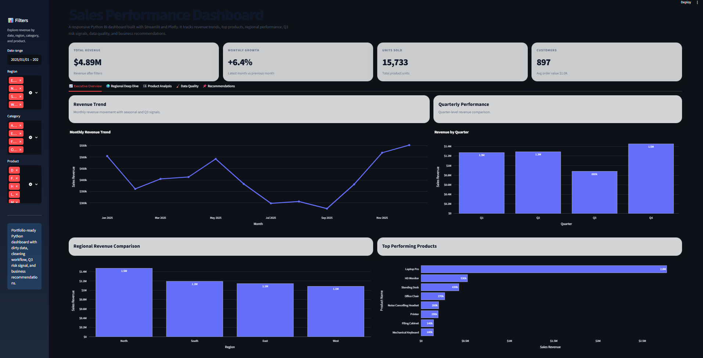

📊 Sales Performance Dashboard | Excel & Power BI

📌 Overview
This project analyzes 12 months of sales data to uncover revenue trends, evaluate regional performance, and generate actionable business insights using Excel and Power BI.

---

📸 Dashboard Preview

---

🛠️ Tools Used
- Microsoft Excel (Data Cleaning & Preparation)  
- Microsoft Power BI (Dashboard Development)  
- DAX (Data Analysis Expressions)

---

🚀 Project Highlights
- Cleaned and processed 12 months of raw sales data  
- Resolved missing values and duplicates to improve data quality  
- Built an interactive Power BI dashboard with dynamic slicers  
- Designed KPIs including Total Revenue, Growth %, and Units Sold  
- Visualized revenue trends, product performance, and regional insights  
- Identified a 22% revenue decline in Q3 and analyzed root causes  

---

🔄 Process

### 1. Data Cleaning (Excel)
- Removed duplicate records  
- Handled missing values  
- Standardized formats for consistency  
- Ensured high data accuracy for analysis  

2. Data Visualization (Power BI)
- Developed an interactive dashboard including:
- Revenue trends (monthly & quarterly)  
- Top-performing products  
- Regional performance comparison  
- Key KPIs (Revenue, Growth %, Units Sold)  
- Used DAX for calculated measures  
- Implemented slicers for dynamic filtering  

---

📊 Key Insights
- Identified a **22% revenue drop in Q3**  
- Detected underperforming regions impacting overall performance  
- Highlighted top products driving revenue  

---

💡 Business Recommendations
- Implement targeted promotions in low-performing regions  
- Optimize inventory allocation based on demand patterns  
- Use dashboard insights for ongoing performance monitoring  

---

📌 License
This project is for portfolio demonstration only. All rights reserved.

---

👤 Author
[Hassam Bin Tariq] 

---

